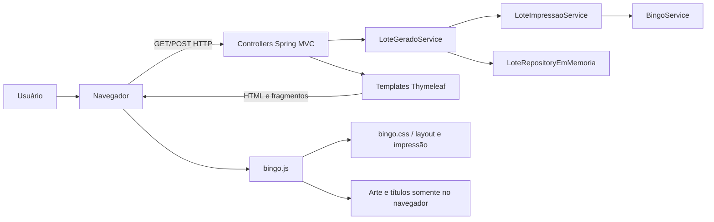
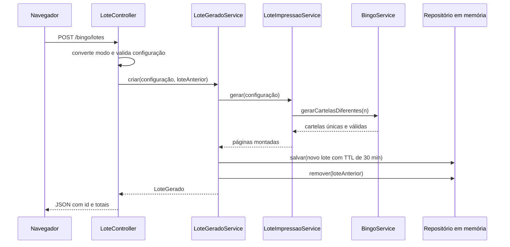
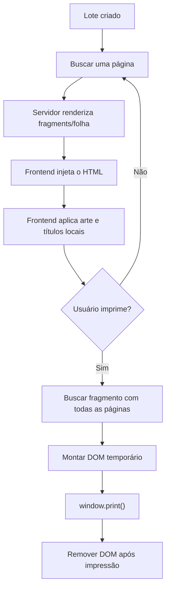
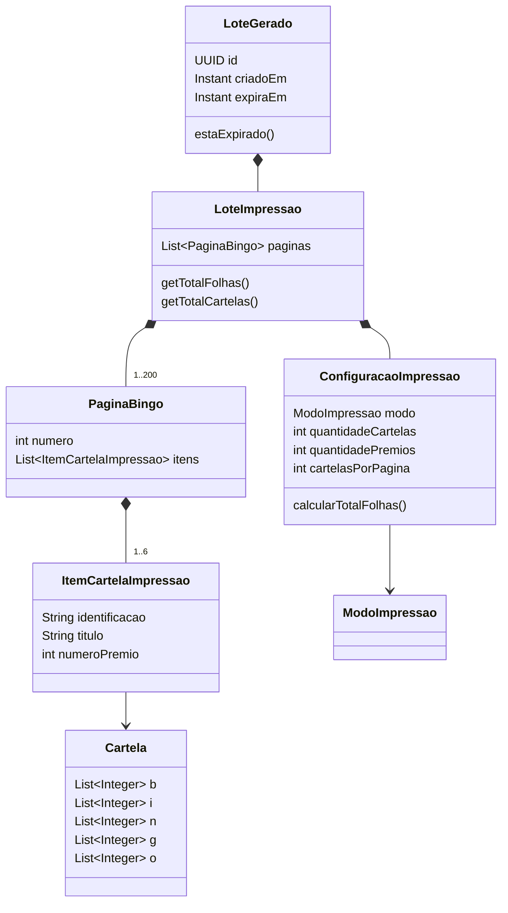

# PROJECT_CONTEXT — Gerador de cartelas de bingo

> Documento-mestre técnico e funcional do projeto. Deve permitir que uma pessoa desenvolvedora ou uma IA compreenda o produto, sua implementação, suas garantias, limitações e caminhos de evolução sem depender de conhecimento transmitido oralmente.

## 1. Identificação do projeto

| Campo | Valor |
|---|---|
| Nome funcional | Gerador de cartelas de bingo |
| Artefato Maven | `br.com.bingo:bingo:0.0.1-SNAPSHOT` |
| Tipo de aplicação | Aplicação web monolítica, renderizada no servidor, com interatividade no navegador |
| Linguagem principal | Java 21 |
| Framework de backend | Spring Boot 4.1.0 / Spring MVC |
| Template engine | Thymeleaf |
| Frontend | HTML, CSS e JavaScript puro, sem framework e sem etapa de build |
| Persistência | Memória local do processo Java |
| Banco de dados | Não utilizado |
| Autenticação | Não existe |
| Idioma da interface | Português do Brasil (`pt-BR`) |
| Formato de impressão | A4, orientação paisagem |
| Entrada principal | `http://localhost:8080/bingo` |
| Data desta análise | 6 de agosto de 2026 |
| Estado verificado | 25 testes executados com sucesso em 6 de agosto de 2026 |

Este documento descreve o comportamento observado no código-fonte atual. Quando houver divergência, a ordem de autoridade é:

1. testes automatizados executáveis;
2. código-fonte em `src/main`;
3. este documento;
4. `README.md` e demais materiais auxiliares.

O documento deve ser atualizado sempre que regras de negócio, endpoints, armazenamento, impressão ou limites forem alterados.

---

## 2. Resumo executivo

O sistema cria lotes de cartelas para bingo tradicional de 75 números e prepara essas cartelas para impressão. Ele atende a dois cenários:

1. **Uma cartela para vários prêmios:** cada folha representa uma cartela diferente, repetida de uma a seis vezes na mesma folha. Cada repetição corresponde a um prêmio.
2. **Cartelas para os jogadores:** cada cartela possui números diferentes e as cartelas são distribuídas em grupos de 2, 4 ou 6 por folha para economizar papel.

O usuário pode escolher de 1 a 200 cartelas diferentes, personalizar localmente os nomes dos prêmios e aplicar uma imagem do evento. A imagem e os nomes personalizados permanecem no navegador; não são enviados ao servidor. O backend gera os números, monta todas as páginas do lote e guarda o lote temporariamente por 30 minutos. A interface solicita apenas a página atualmente visualizada. O HTML completo é solicitado somente quando o usuário aciona a impressão.

O produto é simples de operar, preserva a privacidade da arte e possui boas garantias automatizadas para as regras centrais. Em contrapartida, o armazenamento em memória limita a escalabilidade e a tolerância a reinicializações, e não há autenticação, rate limiting, observabilidade de produção nem testes automatizados do JavaScript e da impressão real.

---

## 3. Problema resolvido

Organizadores de eventos precisam criar e imprimir cartelas de bingo sem montar manualmente combinações numéricas ou diagramar cada folha. O sistema automatiza:

- geração de combinações válidas;
- garantia de que não existam cartelas duplicadas no mesmo lote;
- identificação sequencial das cartelas;
- repetição da mesma cartela quando há vários prêmios;
- agrupamento de cartelas diferentes por folha;
- paginação da prévia;
- aplicação local da arte do evento;
- composição de folhas A4 em paisagem;
- preparação do lote completo para impressão ou para “Salvar como PDF” pelo navegador.

### 3.1 Público-alvo presumido

- organizadores de bingos comunitários, escolares, religiosos ou beneficentes;
- pessoas sem conhecimento técnico que precisam imprimir cartelas rapidamente;
- gráficas ou colaboradores responsáveis por preparar as folhas do evento.

### 3.2 Fora do escopo atual

O sistema **não** oferece:

- sorteio ou chamada das bolas do bingo;
- conferência automática de vencedores;
- cadastro de participantes;
- venda, reserva ou pagamento de cartelas;
- login, permissões ou painel administrativo;
- histórico permanente de lotes;
- recuperação de um lote após reinício do servidor;
- geração de PDF no backend;
- envio da arte ao backend;
- compartilhamento intencional de lotes entre usuários;
- API pública versionada;
- suporte configurável a bingo de 90 números ou outras variantes.

---

## 4. Jornada completa do usuário

### 4.1 Abertura da aplicação

1. O acesso a `/` redireciona para `/bingo`.
2. Ao abrir `/bingo`, o servidor já cria um lote inicial com uma cartela e um prêmio.
3. O servidor renderiza a página principal com somente a primeira folha desse lote.
4. O navegador lê do elemento `#folha-atual` o UUID do lote, o total de folhas e a página atual.

Consequência importante: apenas visitar a página cria e armazena um lote temporário no servidor.

### 4.2 Configuração

O usuário escolhe:

- o modo de impressão;
- a quantidade de cartelas diferentes, de 1 a 200;
- de 1 a 6 prêmios, no modo `VARIOS_PREMIOS`; ou
- 2, 4 ou 6 cartelas por página, no modo `CARTELAS_PARA_JOGADORES`.

No modo de vários prêmios, o usuário também pode escrever nomes de até 50 caracteres para os prêmios. Esses campos não têm atributo `name`, não integram a requisição e são aplicados ao HTML por JavaScript com `textContent`.

### 4.3 Geração e atualização automática

- Alterações de modo, quantidade de prêmios ou cartelas por folha agendam uma nova geração.
- A digitação da quantidade de cartelas também agenda uma geração.
- O atraso de estabilização (*debounce*) é de 350 ms.
- Se uma geração estiver em andamento, o frontend registra uma regeneração pendente, em vez de iniciar requisições concorrentes deliberadamente.
- Ao criar um lote, o UUID anterior é enviado como `loteAnterior`.
- O servidor salva o lote novo e remove o lote anterior.
- O botão “Gerar outros números” mantém a configuração e solicita um lote com novas combinações.

### 4.4 Navegação da prévia

1. O `POST /bingo/lotes` retorna metadados, mas não o HTML de todas as folhas.
2. O frontend solicita `GET /bingo/lotes/{id}/paginas/1`.
3. Os botões “Anterior” e “Próxima” solicitam uma folha por vez.
4. O fragmento retornado substitui o conteúdo de `#folha-atual`.
5. A arte e os títulos personalizados são reaplicados localmente ao novo fragmento.

### 4.5 Arte do evento

O usuário pode selecionar ou arrastar uma imagem:

- formatos aceitos pelo frontend: PNG, JPEG e WebP;
- tamanho máximo verificado: 8 MiB (`8 * 1024 * 1024` bytes);
- leitura: `FileReader.readAsDataURL`;
- armazenamento: variável JavaScript `arteAtual`;
- envio ao servidor: nenhum;
- duração: até remover a arte, recarregar ou fechar a página.

Com 1 a 5 itens na folha, a imagem ocupa uma célula da grade, normalmente o centro superior. Com 6 itens, não existe célula livre e a imagem é aplicada como marca-d'água suave atrás das cartelas.

### 4.6 Impressão

1. O usuário clica em “Imprimir”.
2. O frontend solicita `GET /bingo/lotes/{id}/impressao`.
3. O servidor renderiza todas as páginas do lote em um único fragmento HTML.
4. O frontend cria temporariamente `#impressao-temporaria` no `body`.
5. A arte e os títulos personalizados são aplicados a todas as folhas.
6. O código aguarda a decodificação das imagens e duas atualizações de renderização do navegador.
7. `window.print()` abre o diálogo nativo.
8. O usuário escolhe uma impressora ou “Salvar como PDF”.
9. No evento `afterprint`, o conteúdo temporário é removido do DOM.

Uma nova tentativa de impressão remove previamente qualquer contêiner temporário que tenha permanecido no DOM.

---

## 5. Regras de negócio

### 5.1 Estrutura de uma cartela

Cada cartela segue o bingo tradicional de 75 números:

| Coluna | Faixa permitida | Quantidade jogável |
|---|---:|---:|
| B | 1–15 | 5 |
| I | 16–30 | 5 |
| N | 31–45 | 4, pois o centro é livre |
| G | 46–60 | 5 |
| O | 61–75 | 5 |

Invariantes:

- cada coluna possui exatamente cinco posições;
- a terceira posição da coluna N é `null` no modelo e aparece como `LIVRE` na interface;
- toda cartela contém exatamente 24 números jogáveis;
- não há repetição dentro de uma coluna;
- os valores respeitam a faixa da coluna;
- os números de cada coluna aparecem em ordem crescente;
- o objeto `Cartela` faz cópias defensivas e expõe listas não modificáveis;
- igualdade e `hashCode` consideram o conteúdo das cinco colunas.

Como as faixas das colunas não se sobrepõem, a validação de repetição por coluna também implica ausência de números repetidos na cartela inteira.

### 5.2 Geração aleatória

O `BingoService` usa `SecureRandom` em produção. Para cada coluna:

1. cria um vetor com todos os 15 valores possíveis;
2. embaralha o vetor com Fisher–Yates;
3. seleciona os primeiros 5 valores, ou 4 na coluna N;
4. ordena os selecionados;
5. insere `null` no centro da coluna N.

Para gerar um lote, as cartelas são inseridas em um `LinkedHashSet`. Como `Cartela` implementa igualdade estrutural, uma combinação já existente no lote é descartada e outra é gerada. O resultado preserva a ordem de criação e é convertido em lista imutável.

O limite atual de 200 cartelas é extremamente pequeno em relação ao espaço de combinações possíveis. Portanto, colisões são improváveis. O laço, contudo, não possui limite explícito de tentativas; ele depende da grande quantidade de combinações possíveis e do funcionamento adequado do gerador aleatório.

### 5.3 Modo `VARIOS_PREMIOS`

Objetivo: usar a mesma combinação em todos os prêmios de uma determinada folha.

- cartelas diferentes: 1 a 200;
- prêmios por folha: 1 a 6;
- total de folhas: igual à quantidade de cartelas diferentes;
- itens impressos: `quantidadeCartelas × quantidadePremios`;
- todos os itens de uma folha apontam para o mesmo objeto `Cartela`;
- folhas diferentes possuem cartelas diferentes;
- títulos padrão: `1º prêmio`, `2º prêmio`, ..., `6º prêmio`;
- identificação da cartela: `Cartela 001`, `Cartela 002`, etc.

Exemplo: 50 cartelas e 6 prêmios produzem 50 folhas e 300 quadros. Os seis quadros da primeira folha usam a combinação `Cartela 001`; os seis da segunda usam `Cartela 002`.

### 5.4 Modo `CARTELAS_PARA_JOGADORES`

Objetivo: distribuir combinações diferentes em folhas com melhor aproveitamento de papel.

- cartelas diferentes: 1 a 200;
- quantidades permitidas por folha: 2, 4 ou 6;
- quantidade de prêmios normalizada para zero;
- total de folhas: `ceil(quantidadeCartelas / cartelasPorPagina)`;
- a última folha pode conter menos itens;
- cada item usa uma cartela diferente;
- título visual fixo: `Bingo`;
- identificação sequencial: `Cartela 001`, `Cartela 002`, etc.

Exemplo: 50 cartelas, com 6 por folha, produzem 9 folhas. As oito primeiras possuem seis cartelas e a última possui duas.

### 5.5 Normalização da configuração

O construtor de `ConfiguracaoImpressao` não apenas valida; ele normaliza campos irrelevantes:

- em `VARIOS_PREMIOS`, `cartelasPorPagina` é sempre convertido para `1`;
- em `CARTELAS_PARA_JOGADORES`, `quantidadePremios` é sempre convertida para `0`.

Isso evita que configurações semanticamente equivalentes carreguem valores contraditórios.

---

## 6. Arquitetura

### 6.1 Visão em camadas



### 6.2 Características arquiteturais

- monólito MVC de pequeno porte;
- componentes instanciados e injetados pelo Spring;
- domínio sem dependência direta do Spring;
- repositório abstraído por interface, apesar de haver apenas uma implementação;
- comunicação incremental com fragmentos HTML, sem SPA;
- JSON usado somente na criação do lote;
- estado numérico mantido no backend e estado visual personalizado mantido no frontend;
- objetos de domínio predominantemente imutáveis;
- aplicação *stateless* quanto a sessão HTTP, mas *stateful* quanto à memória do processo.

### 6.3 Fluxo de criação de lote



### 6.4 Fluxo de prévia e impressão



---

## 7. Catálogo de componentes

### 7.1 Inicialização

| Classe | Responsabilidade |
|---|---|
| `BingoApplication` | Ponto de entrada; inicia o contexto Spring Boot e a aplicação web. |

### 7.2 Controllers

| Classe | Responsabilidade |
|---|---|
| `BingoController` | Redireciona `/` e renderiza a tela inicial `/bingo`, criando o lote inicial. |
| `LoteController` | Cria lotes, entrega páginas e impressão, converte o modo e formata erros conhecidos. |
| `LoteCriadoResponse` | DTO JSON imutável com UUID textual, totais e modo efetivo. |

### 7.3 Serviços

| Classe | Responsabilidade |
|---|---|
| `BingoService` | Gera cartelas válidas, ordenadas e diferentes entre si. |
| `LoteImpressaoService` | Transforma cartelas em páginas conforme o modo escolhido. |
| `LoteGeradoService` | Atribui UUID e prazo, salva, substitui o lote anterior e consulta páginas. |
| `LoteNaoEncontradoException` | Representa lote ausente, expirado ou removido. |

### 7.4 Modelo de domínio

| Classe | Conteúdo e invariantes |
|---|---|
| `Cartela` | Cinco colunas validadas, centro livre, igualdade estrutural e listas imutáveis. |
| `ConfiguracaoImpressao` | Modo, quantidade, prêmios e densidade por folha; valida e normaliza valores. |
| `ModoImpressao` | Enum com `VARIOS_PREMIOS` e `CARTELAS_PARA_JOGADORES`. |
| `ItemCartelaImpressao` | Cartela, identificação, título e número do prêmio. |
| `PaginaBingo` | Número positivo e lista imutável de 1 a 6 itens. |
| `LoteImpressao` | Configuração e páginas; exige que o total corresponda ao cálculo da configuração. |
| `LoteGerado` | UUID, conteúdo, criação e expiração; exige expiração posterior à criação. |

### 7.5 Persistência temporária

| Componente | Responsabilidade |
|---|---|
| `LoteRepository` | Contrato para salvar, buscar e remover lotes. |
| `LoteRepositoryEmMemoria` | Implementação concorrente com `ConcurrentHashMap`, TTL e limite de lotes. |

### 7.6 Frontend

| Arquivo | Responsabilidade |
|---|---|
| `templates/bingo.html` | Estrutura da tela, formulário, controles, prévia inicial e semântica acessível. |
| `templates/fragments/folha.html` | Renderização de uma folha e de suas tabelas BINGO. |
| `templates/fragments/impressao.html` | Iteração sobre todas as páginas para impressão. |
| `static/js/bingo.js` | Estado da interface, requisições, paginação, personalização local e impressão. |
| `static/css/bingo.css` | Tema, responsividade, distribuição da grade A4 e regras `@media print`. |
| `application.properties` | Nome da aplicação, porta e codificação UTF-8. |

---

## 8. Contrato HTTP

Não há prefixo `/api` nem versionamento. Os endpoints são internos à própria interface.

### 8.1 Tabela de endpoints

| Método | Caminho | Resposta | Finalidade |
|---|---|---|---|
| `GET` | `/` | Redirecionamento 3xx para `/bingo` | Entrada curta. |
| `GET` | `/bingo` | Página HTML completa | Abre o gerador e cria um lote inicial. |
| `POST` | `/bingo/lotes` | JSON | Gera e armazena um novo lote. |
| `GET` | `/bingo/lotes/{id}/paginas/{numero}` | Fragmento HTML | Retorna uma página específica do lote. |
| `GET` | `/bingo/lotes/{id}/impressao` | Fragmento HTML | Retorna todas as páginas do lote. |

### 8.2 `POST /bingo/lotes`

Content-Type enviado pela interface:

```text
application/x-www-form-urlencoded;charset=UTF-8
```

Parâmetros:

| Nome | Tipo | Obrigatoriedade HTTP | Padrão | Regra |
|---|---|---|---|---|
| `modo` | texto | opcional | `VARIOS_PREMIOS` | Deve coincidir exatamente com um valor de `ModoImpressao`. |
| `quantidadeCartelas` | inteiro | opcional | `1` | De 1 a 200. |
| `quantidadePremios` | inteiro | opcional | `1` | De 1 a 6 no modo de prêmios; ignorado e zerado no outro modo. |
| `cartelasPorPagina` | inteiro | opcional | `4` | 2, 4 ou 6 no modo jogadores; ignorado e convertido para 1 no outro modo. |
| `loteAnterior` | UUID | opcional | ausente | Se válido e existente, é removido depois que o lote novo é salvo. |

Exemplo de requisição:

```text
modo=VARIOS_PREMIOS&quantidadeCartelas=50&quantidadePremios=6&cartelasPorPagina=4
```

Exemplo de resposta de sucesso:

```json
{
  "id": "95a399b9-b14d-4b64-a9cc-1885d7531e7b",
  "totalFolhas": 50,
  "totalCartelas": 50,
  "modo": "VARIOS_PREMIOS"
}
```

O cabeçalho `Cache-Control: no-store` é definido explicitamente.

### 8.3 Consulta de página

`GET /bingo/lotes/{id}/paginas/{numero}` exige:

- `id` como UUID de lote ainda disponível;
- `numero` entre 1 e `totalFolhas`, inclusive.

A resposta é o fragmento `fragments/folha :: folha`, não um documento HTML independente. O frontend o injeta em `#folha-atual`.

### 8.4 Consulta de impressão

`GET /bingo/lotes/{id}/impressao` retorna `fragments/impressao :: impressao`, contendo todas as páginas. Esse endpoint pode produzir uma resposta significativamente maior que a consulta paginada.

### 8.5 Erros tratados explicitamente

| Situação | Status | Corpo |
|---|---:|---|
| Configuração ou página inválida | `400 Bad Request` | HTML com `<p class="erro-lote">...</p>` |
| Lote ausente, removido ou expirado | `404 Not Found` | HTML orientando a gerar nova prévia |

As mensagens oriundas das exceções tratadas são escapadas com `HtmlUtils.htmlEscape`, reduzindo risco de injeção HTML. As respostas de erro usam UTF-8 e `Cache-Control: no-store`.

Erros de conversão realizados pelo próprio Spring, como UUID ou inteiro sintaticamente inválido, não passam pelos dois handlers específicos documentados acima; ficam sujeitos ao tratamento padrão do framework.

---

## 9. Modelo de dados e relações



No modo de prêmios, vários `ItemCartelaImpressao` da mesma página referenciam a mesma `Cartela`. No modo jogadores, cada item do lote referencia uma cartela diferente.

---

## 10. Ciclo de vida e armazenamento dos lotes

### 10.1 Estrutura

Os lotes residem em um `ConcurrentHashMap<UUID, LoteGerado>` dentro da instância da aplicação.

### 10.2 Expiração

- tempo de vida: 30 minutos contados desde a criação;
- o prazo é absoluto e não é renovado por acesso;
- um lote é considerado expirado quando `expiraEm` é igual ou anterior ao instante atual;
- uma busca por lote expirado o remove e responde como inexistente;
- antes de salvar um lote, o repositório remove todos os expirados.

Não existe tarefa agendada de limpeza. Portanto, lotes expirados podem continuar ocupando entradas até uma nova gravação ou até uma busca pelo próprio UUID. Isso não os torna consultáveis após o vencimento.

### 10.3 Limite de capacidade

- limite pretendido: 500 lotes ativos;
- antes de salvar, se já houver pelo menos 500 lotes, o lote de criação mais antiga é removido;
- o limite é por processo Java, não por usuário;
- a verificação e a inclusão não formam uma operação atômica única. Em picos de gravações concorrentes, o total pode exceder temporariamente o limite pretendido.

### 10.4 Substituição do lote anterior

Ao gerar um novo lote pela interface:

1. o lote novo é totalmente gerado;
2. o lote novo é salvo;
3. o UUID indicado em `loteAnterior` é removido.

Se a geração falhar antes do salvamento, o lote anterior continua disponível. O servidor não verifica se o lote anterior pertence ao mesmo navegador, pois não existe identidade de usuário ou sessão de propriedade.

### 10.5 Consequências operacionais

- reiniciar ou republicar a aplicação invalida todos os UUIDs;
- múltiplas instâncias sem afinidade de sessão ou armazenamento compartilhado não funcionam de modo confiável;
- memória consumida cresce com a quantidade e o tamanho dos lotes ativos;
- não existe backup, restauração ou auditoria histórica;
- o UUID funciona como identificador difícil de adivinhar, mas não como autorização formal.

---

## 11. Frontend e estado local

### 11.1 Estado mantido por `bingo.js`

| Variável | Significado |
|---|---|
| `loteId` | UUID do lote numérico atualmente exibido. |
| `totalFolhas` | Total informado pelo backend. |
| `paginaAtual` | Página exibida na prévia. |
| `arteAtual` | Data URL da imagem, somente no navegador. |
| `gerando` | Evita geração concorrente iniciada pela interface. |
| `regerarPendente` | Solicita uma nova geração ao terminar a atual. |
| `temporizador` | Controla o *debounce* de 350 ms. |

Esse estado não é salvo em `localStorage`, `sessionStorage`, cookie ou URL. Recarregar a página começa uma nova configuração inicial e uma nova arte vazia.

### 11.2 Validação no navegador

- quantidade aceita: inteiro entre 1 e 200;
- o input HTML também declara `min`, `max`, `required` e `inputmode="numeric"`;
- o formulário usa `novalidate`; ao envio explícito, o código chama `reportValidity()` somente para a quantidade quando necessário;
- modos e quantidades fixas são apresentados como radios, reduzindo a possibilidade de valores inválidos pela interface normal;
- o backend repete as validações essenciais e é a autoridade final.

### 11.3 Personalização segura do texto

Os nomes de prêmio são inseridos por `textContent`, não por `innerHTML`. O nome do arquivo também é exibido por `textContent`. Isso evita interpretar como HTML o texto fornecido pelo usuário.

### 11.4 Requisições e mensagens

- `fetch` usa `cache: "no-store"`;
- durante operações, botões são desabilitados e `aria-busy` é atualizado;
- erros HTML são convertidos em texto com `DOMParser` antes de serem apresentados;
- mensagens de status usam `role="status"` e `aria-live="polite"`;
- a interface informa carregamento, sucesso e falha.

### 11.5 Dependência de JavaScript

A página inicial é renderizada e mostra uma folha sem JavaScript, mas geração dinâmica, paginação, arte, personalização dos títulos e preparação do lote completo para impressão dependem de JavaScript habilitado.

---

## 12. Layout e impressão

### 12.1 Grade física

- papel: A4;
- orientação: paisagem;
- grade lógica: 3 colunas × 2 linhas;
- máximo: 6 itens por folha;
- CSS da prévia usa proporção `297 / 210`;
- CSS de impressão usa `@page { size: A4 landscape; margin: 5mm; }`;
- cada folha tenta ocupar até 285 mm × 195 mm dentro das margens;
- a grade impressa possui altura de 182 mm, duas linhas de 88 mm e espaçamentos em milímetros.

### 12.2 Distribuição com arte

| Itens | Tratamento da arte |
|---:|---|
| 1–4 | Arte no centro superior; cartelas distribuídas em posições específicas ao redor. |
| 5 | Arte preenche a sexta posição disponível da grade. |
| 6 | Arte vira marca-d'água atrás de toda a grade. |

Para 5 itens, não são necessárias regras posicionais específicas: os itens ocupam o fluxo normal da grade e o bloco de arte, anexado por último, ocupa a posição restante. Para 6 itens, o bloco não é criado; usa-se a imagem absoluta `.marca-dagua-evento`.

### 12.3 Distribuição sem arte

- 1 item: centralizado;
- 2 itens: separados nas laterais;
- 3 itens: distribuídos pelas três colunas;
- 4 itens: ocupam os quatro cantos;
- 5 e 6 itens: seguem o preenchimento natural da grade.

### 12.4 Responsividade da interface

- acima de 1050 px: configuração lateral e prévia em duas colunas;
- até 1050 px: painel e prévia passam para uma coluna;
- até 620 px: espaçamentos, controles e campos são compactados;
- o painel de configuração é fixo durante rolagem em telas largas e deixa de ser fixo em telas menores.

### 12.5 Compatibilidade e riscos de impressão

O layout depende de recursos CSS modernos, incluindo `:has()`, grid, `aspect-ratio`, `break-after` e `print-color-adjust`. Navegadores atuais tendem a suportá-los, mas o resultado final pode variar conforme:

- navegador e versão;
- driver da impressora;
- margens mínimas físicas;
- escala escolhida no diálogo;
- opção de imprimir gráficos de fundo;
- proporção e resolução da arte;
- limites de memória ao imprimir muitas páginas.

Não há teste automatizado que compare visualmente PDFs ou impressões entre navegadores.

---

## 13. Privacidade e segurança

### 13.1 Dados processados pelo servidor

O servidor recebe apenas a configuração numérica, o modo e, opcionalmente, o UUID anterior. Ele gera e guarda:

- combinações das cartelas;
- organização das páginas;
- UUID;
- instantes de criação e expiração.

### 13.2 Dados que permanecem no navegador

- arquivo e conteúdo da arte do evento;
- nome do arquivo;
- nomes personalizados dos prêmios.

Esses dados são reaplicados sobre o HTML retornado pelo backend e desaparecem ao recarregar ou fechar a página.

### 13.3 Controles positivos existentes

- UUID aleatório para os lotes;
- mensagens conhecidas escapadas antes de serem incluídas em HTML de erro;
- textos personalizados aplicados via `textContent`;
- imagem limitada a tipos destinados a raster e WebP, sem SVG;
- limite de 8 MiB no frontend;
- respostas sensíveis do fluxo marcadas como `no-store`;
- limite de 200 cartelas por requisição;
- limite pretendido de 500 lotes na memória;
- uso de `SecureRandom` para a geração normal.

### 13.4 Limitações e ameaças

| Risco | Situação atual | Impacto possível |
|---|---|---|
| Ausência de autenticação/autorização | Qualquer cliente com um UUID válido pode consultar o lote. | Exposição das combinações, embora não da arte ou dos títulos locais. |
| Ausência de rate limiting | Um cliente pode criar muitos lotes rapidamente. | Consumo de CPU e memória, além de expulsão de lotes legítimos. |
| Armazenamento em memória | Todo conteúdo reside no heap do processo. | Esgotamento de memória sob carga ou lotes simultâneos. |
| Validação de imagem somente no cliente | `arquivo.type` e tamanho são verificados pelo navegador. | Cliente modificado ignora a validação, embora a imagem nunca seja enviada ao servidor. O risco fica no próprio navegador. |
| UUID anterior sem vínculo de propriedade | Um cliente que conheça outro UUID pode pedir sua remoção. | Negação de acesso ao lote conhecido. |
| Sem cabeçalhos de segurança configurados | Não há política CSP, HSTS ou configuração explícita equivalente no projeto. | Menor defesa em profundidade quando publicado. |
| Sem Spring Security | Não há CSRF, login ou políticas de autorização fornecidas por esse módulo. | Endpoint de criação pode ser acionado sem proteção específica. |
| Sem limitação explícita da resposta de impressão | Até 200 páginas podem ser renderizadas de uma vez. | Uso elevado de memória no servidor e navegador. |

Como não existem dados pessoais, pagamentos ou contas no escopo atual, a sensibilidade do conteúdo do backend é baixa. Ainda assim, proteção contra abuso é relevante para uma publicação aberta na internet.

---

## 14. Desempenho, concorrência e escalabilidade

### 14.1 Pontos eficientes

- apenas uma página é transferida durante a navegação;
- cartelas são geradas uma única vez por lote;
- objetos são reutilizados entre os prêmios da mesma folha;
- não há consultas de banco, serialização complexa ou processamento de imagens no servidor;
- `ConcurrentHashMap` permite consultas concorrentes;
- o frontend combina eventos rápidos e evita requisições simultâneas intencionais de geração.

### 14.2 Custos relevantes

- o lote completo, inclusive todas as páginas, permanece na memória;
- a impressão renderiza todas as páginas em uma única resposta;
- uma arte em Data URL pode aparecer como `src` em muitas imagens no DOM de impressão;
- o endpoint de criação executa geração síncrona na thread HTTP;
- `SecureRandom` e a montagem dos objetos geram custo proporcional à quantidade de cartelas;
- a busca pelo lote mais antigo é linear no número de lotes quando o limite é alcançado;
- cada abertura de `/bingo` cria um lote, mesmo sem interação posterior.

### 14.3 Escala suportada conceitualmente

O desenho atual é apropriado para uma aplicação pequena, de uma única instância e tráfego moderado. Não deve ser considerado horizontalmente escalável sem alterações.

Para múltiplas instâncias, seria necessário pelo menos um destes caminhos:

- armazenamento compartilhado com TTL, como Redis;
- afinidade de sessão no balanceador, aceitando perda em reinícios;
- tornar o lote autocontido/reproduzível por uma semente assinada;
- gerar o documento final de maneira assíncrona e armazená-lo temporariamente.

---

## 15. Tratamento de falhas

### 15.1 Falhas conhecidas apresentadas ao usuário

- quantidade de cartelas fora de 1–200;
- quantidade de prêmios fora de 1–6;
- quantidade por folha diferente de 2, 4 ou 6;
- modo inexistente;
- número de página fora do lote;
- lote expirado, removido ou inexistente;
- falha HTTP ao criar, navegar ou preparar impressão;
- imagem com tipo/tamanho inválido;
- falha local na leitura da imagem.

### 15.2 Recuperação

- configuração inválida: corrigir valores e gerar novamente;
- lote expirado: gerar uma nova prévia;
- falha de rede: tentar novamente enquanto o lote ainda existir;
- arte inválida: escolher outro arquivo;
- falha de impressão: repetir a operação; o contêiner temporário anterior é removido antes da nova tentativa.

### 15.3 Lacunas

- não há página global de erro personalizada documentada;
- não há identificador de correlação para suporte;
- não há retentativa automática de requisições;
- não há cancelamento via `AbortController`;
- não há logs de domínio ou métricas para diagnosticar expiração, capacidade e latência;
- exceções inesperadas dependem da resposta padrão do Spring Boot.

---

## 16. Testes e garantias verificadas

### 16.1 Resultado da verificação

Comando executado em 6 de agosto de 2026:

```powershell
mvn test
```

Resultado:

```text
Tests run: 25, Failures: 0, Errors: 0, Skipped: 0
BUILD SUCCESS
```

O Maven Wrapper presente no projeto não iniciou corretamente no ambiente usado para esta análise; o Maven instalado no sistema executou a suíte com sucesso. Isso indica uma possível limitação ambiental do script, não uma falha comprovada no código da aplicação.

Durante os testes apareceu um aviso de que o Mockito se anexa dinamicamente para habilitar o *inline mock maker* e que esse comportamento será restringido em versões futuras do JDK. O aviso não causou falha, mas merece acompanhamento em futuras atualizações do Java/Mockito.

### 16.2 Cobertura comportamental existente

| Área | Garantias testadas |
|---|---|
| Inicialização | Contexto Spring sobe corretamente. |
| Rotas | Redirecionamento, abertura da tela, criação, página específica e impressão. |
| HTTP | Metadados JSON, `no-store`, erro 400 e erro 404. |
| Cartela | Igualdade, `hashCode`, imutabilidade, faixas, repetição e centro livre. |
| Geração | Tamanhos, faixas, 24 números, ordenação, determinismo em teste e 200 cartelas únicas. |
| Configuração | Cálculo de folhas, normalização e rejeição de quantidades inválidas. |
| Montagem | 50×6 no modo prêmios e 50/6 no modo jogadores, inclusive última folha incompleta. |
| Repositório | Salvar, remover e recusar lote expirado. |
| Ciclo do lote | Consulta paginada e substituição do lote anterior. |

### 16.3 O que não está coberto automaticamente

- comportamento de `bingo.js`;
- *debounce* e regeneração pendente;
- seleção, arrastar/soltar e remoção da arte;
- títulos personalizados;
- acessibilidade em navegador/leitor de tela;
- responsividade visual;
- impressão real ou PDF gerado;
- compatibilidade entre Chrome, Edge, Firefox e Safari;
- carga, concorrência e limite efetivo de 500 lotes;
- limpeza total de expirados em cenários prolongados;
- cabeçalhos e postura de segurança em produção;
- falhas inesperadas e tratamento global;
- implantação em provedor externo.

---

## 17. Execução, build e publicação

### 17.1 Pré-requisitos

- Java 21;
- Maven instalado ou Maven Wrapper funcional no ambiente;
- navegador moderno com JavaScript habilitado para a experiência completa.

### 17.2 Execução local

No Windows, tentativa preferencial:

```powershell
.\mvnw.cmd spring-boot:run
```

Alternativa com Maven instalado:

```powershell
mvn spring-boot:run
```

Acesse:

```text
http://localhost:8080
```

### 17.3 Testes

```powershell
mvn test
```

### 17.4 Empacotamento

```powershell
mvn clean package
java -jar target\bingo-0.0.1-SNAPSHOT.jar
```

### 17.5 Porta

```properties
server.port=${PORT:8080}
```

Localmente, a porta padrão é 8080. Em hospedagens que fornecem a variável `PORT`, o Spring usa o valor recebido.

### 17.6 Estado atual de infraestrutura

O repositório não apresenta, na estrutura analisada:

- `Dockerfile`;
- configuração de CI/CD;
- manifesto específico de Railway, Render, Fly.io ou Kubernetes;
- Actuator ou endpoint explícito de health check;
- configuração externa de memória/JVM;
- banco de dados ou migrações;
- arquivo de licença.

Antes de produção pública, é recomendável definir limites de memória, health check, HTTPS, logs, métricas e proteção contra abuso.

---

## 18. Estrutura de diretórios

```text
SPRINGbingo/
├── .mvn/
├── src/
│   ├── main/
│   │   ├── java/br/com/bingo/
│   │   │   ├── BingoApplication.java
│   │   │   ├── controller/
│   │   │   │   ├── BingoController.java
│   │   │   │   ├── LoteController.java
│   │   │   │   └── LoteCriadoResponse.java
│   │   │   ├── model/
│   │   │   │   ├── Cartela.java
│   │   │   │   ├── ConfiguracaoImpressao.java
│   │   │   │   ├── ItemCartelaImpressao.java
│   │   │   │   ├── LoteGerado.java
│   │   │   │   ├── LoteImpressao.java
│   │   │   │   ├── ModoImpressao.java
│   │   │   │   └── PaginaBingo.java
│   │   │   ├── repository/
│   │   │   │   ├── LoteRepository.java
│   │   │   │   └── LoteRepositoryEmMemoria.java
│   │   │   └── service/
│   │   │       ├── BingoService.java
│   │   │       ├── LoteGeradoService.java
│   │   │       ├── LoteImpressaoService.java
│   │   │       └── LoteNaoEncontradoException.java
│   │   └── resources/
│   │       ├── application.properties
│   │       ├── static/
│   │       │   ├── css/bingo.css
│   │       │   └── js/bingo.js
│   │       └── templates/
│   │           ├── bingo.html
│   │           └── fragments/
│   │               ├── folha.html
│   │               └── impressao.html
│   └── test/java/br/com/bingo/
│       ├── BingoApplicationTest.java
│       ├── controller/BingoControllerTest.java
│       ├── model/
│       ├── repository/
│       └── service/
├── pom.xml
├── mvnw
├── mvnw.cmd
├── README.md
└── PROJECT_CONTEXT.md
```

Os PDFs e a captura de tela presentes na raiz são materiais auxiliares/referências e não participam do build nem da execução da aplicação. A pasta `target/` contém artefatos gerados pelo Maven. A pasta `tmp/` também não integra o código-fonte principal documentado.

---

## 19. Pontos fortes

### 19.1 Produto e experiência

- proposta direta e fluxo guiado por passos;
- dois modos de impressão cobrem necessidades diferentes;
- resumo do lote muda antes da impressão e ajuda a prever consumo de papel;
- prévia paginada evita inserir centenas de folhas no DOM durante a navegação;
- nomes de prêmios e arte podem ser personalizados sem upload;
- impressão usa unidades físicas e regras próprias para A4;
- interface responsiva e com mensagens de estado.

### 19.2 Regras e domínio

- regras do bingo estão centralizadas e validadas no modelo/serviço;
- `Cartela` é imutável e possui igualdade estrutural;
- unicidade do lote decorre do modelo, não apenas de comparação superficial;
- `SecureRandom` é usado na execução normal;
- algoritmos são simples e auditáveis;
- configuração inválida é rejeitada no backend;
- normalização impede estados contraditórios.

### 19.3 Arquitetura e manutenção

- responsabilidades estão bem separadas;
- controllers não contêm o algoritmo de sorteio;
- interface de repositório facilita futura substituição da memória por Redis ou banco;
- `Clock` e `RandomGenerator` podem ser controlados em testes;
- dependências externas são poucas;
- frontend não exige Node.js, bundler ou framework;
- fragmentos Thymeleaf evitam duplicação da marcação de folha.

### 19.4 Privacidade

- a arte nunca sai do navegador;
- os nomes personalizados dos prêmios também não são transmitidos;
- não há cadastro, cookies de negócio, perfil ou histórico pessoal;
- lotes expiram automaticamente e respostas não devem ser armazenadas em cache.

### 19.5 Qualidade verificada

- 25 testes passam no estado analisado;
- testes cobrem os principais limites e exemplos de 50/200 cartelas;
- há teste de imutabilidade e igualdade do domínio;
- há teste de expiração e substituição de lotes;
- há teste de integração mínima do contexto Spring.

---

## 20. Pontos fracos, limitações e dívidas técnicas

### 20.1 Prioridade alta antes de exposição pública intensa

1. **Proteção contra abuso:** não há rate limiting, quota por origem ou limitação de concorrência. Um agente automatizado pode consumir CPU/memória gerando lotes.
2. **Escalabilidade e disponibilidade:** lotes em memória desaparecem em reinício e não são compartilhados entre instâncias.
3. **Observabilidade:** não há métricas sobre lotes ativos, expirações, tempo de geração, tamanho de respostas ou falhas.
4. **Testes de impressão:** o resultado mais importante do produto não possui comparação visual automatizada nem matriz de navegadores.

### 20.2 Prioridade média

1. **Limite concorrente não atômico:** o teto de 500 lotes pode ser excedido temporariamente em gravações simultâneas.
2. **Limpeza reativa:** não existe tarefa agendada para retirar expirados sem nova atividade.
3. **Acesso por UUID sem propriedade:** quem conhecer um UUID pode consultar ou indicar a remoção daquele lote.
4. **Resposta de impressão grande:** até 200 páginas são renderizadas e injetadas de uma vez.
5. **Frontend sem testes:** regras de interação e privacidade local dependem de JavaScript não testado automaticamente.
6. **Tratamento parcial de exceções:** erros de binding e falhas inesperadas não usam necessariamente a mesma resposta amigável.
7. **Dependência de CSS moderno:** impressão e ocultação usam `:has()`, cujo comportamento deve ser validado nos navegadores-alvo.
8. **Wrapper a verificar:** `mvnw.cmd` não iniciou no ambiente desta análise, embora `mvn test` tenha funcionado.

### 20.3 Prioridade baixa ou evolução de produto

1. não existe reprodução de lote por semente;
2. não existe exportação PDF nativa no servidor;
3. nomes de prêmios e arte são perdidos ao recarregar;
4. não existe escolha de cores, cabeçalho, rodapé ou outras dimensões;
5. idioma e textos estão fixos em português;
6. limite de 200 e TTL de 30 minutos estão codificados em Java, não em configuração externa;
7. não há documentação formal de browsers suportados;
8. não há licença declarada;
9. não há CI para garantir testes em cada alteração;
10. não há histórico de versões ou changelog.

---

## 21. Recomendações de evolução

### Fase 1 — Robustez sem mudar o produto

- corrigir/verificar o Maven Wrapper em ambiente limpo;
- adicionar testes unitários do JavaScript;
- adicionar teste end-to-end com navegador para geração, paginação e impressão;
- configurar logs estruturados e métricas básicas;
- externalizar TTL, limite de lotes e limite de cartelas;
- padronizar tratamento global de erros;
- definir e testar navegadores suportados;
- criar CI com `mvn test`.

### Fase 2 — Publicação segura

- adicionar rate limiting por IP/origem ou na borda;
- configurar cabeçalhos de segurança e HTTPS na hospedagem;
- revisar proteção CSRF conforme a forma de publicação;
- limitar requisições simultâneas e observar consumo de heap;
- adicionar health/readiness check;
- configurar limites de memória da JVM;
- realizar teste de carga com lotes máximos;
- decidir se UUID deve ser vinculado a sessão ou token assinado.

### Fase 3 — Escalabilidade

- substituir o repositório por Redis com TTL, mantendo a interface `LoteRepository`;
- ou redesenhar o lote para ser reconstituído por semente assinada;
- avaliar geração assíncrona para documentos grandes;
- reduzir a duplicação da Data URL da arte durante impressão;
- medir tamanho e tempo do HTML completo de 200 páginas.

### Fase 4 — Evolução funcional

- persistência opcional da configuração local;
- temas e cores personalizáveis;
- PDF gerado no servidor, se a consistência entre navegadores for requisito;
- QR code ou código curto de lote;
- outras variantes de bingo;
- recursos de acessibilidade avaliados com usuários e tecnologias assistivas.

---

## 22. Guia para realizar alterações

### 22.1 Alterar regras numéricas

Arquivos principais:

- `model/Cartela.java` para invariantes;
- `service/BingoService.java` para geração;
- `service/BingoServiceTest.java` e `model/CartelaTest.java` para garantias.

Qualquer mudança nas faixas exige ajustar também o template da cartela e este documento.

### 22.2 Alterar limites ou modos

Arquivos principais:

- `model/ConfiguracaoImpressao.java`;
- `model/ModoImpressao.java`;
- `service/LoteImpressaoService.java`;
- `templates/bingo.html`;
- `static/js/bingo.js`;
- testes de configuração, montagem e controller.

O limite de cartelas aparece tanto no backend quanto no HTML/JavaScript. Alterá-lo em apenas um lado cria inconsistência.

### 22.3 Alterar a disposição da folha

Arquivos principais:

- `templates/fragments/folha.html`;
- `static/css/bingo.css`;
- `static/js/bingo.js`, especialmente `aplicarArte`;
- `templates/fragments/impressao.html` se mudar a composição do documento.

Toda alteração deve ser verificada na prévia e na impressão/PDF, incluindo folhas incompletas com 1, 2, 3, 4 e 5 itens e o caso de 6 itens.

### 22.4 Trocar o armazenamento

Implemente `LoteRepository` preservando:

- busca por UUID;
- expiração de 30 minutos ou prazo configurado;
- remoção explícita;
- semântica de lote inexistente/expirado.

Também revise serialização dos objetos, capacidade, concorrência, privacidade e custo do armazenamento.

### 22.5 Adicionar autenticação

Será necessário definir:

- propriedade do lote;
- autorização nos dois endpoints de consulta;
- autorização para `loteAnterior`;
- política CSRF;
- expiração de sessão versus expiração do lote;
- dados pessoais e política de retenção.

---

## 23. Checklist de regressão

Antes de considerar uma alteração concluída:

- [ ] `mvn test` passa integralmente.
- [ ] Uma cartela possui 24 números e centro livre.
- [ ] As cinco faixas BINGO permanecem corretas.
- [ ] Não existem cartelas duplicadas no mesmo lote.
- [ ] 50 cartelas × 6 prêmios produzem 50 folhas.
- [ ] 50 cartelas ÷ 6 por folha produzem 9 folhas, com 2 itens na última.
- [ ] A prévia transfere somente uma folha por navegação.
- [ ] A impressão contém o lote completo.
- [ ] A arte não aparece em requisições de rede.
- [ ] Nomes personalizados não aparecem em requisições de rede.
- [ ] Arte com 6 itens vira marca-d'água.
- [ ] Folhas incompletas continuam centralizadas/diagramadas corretamente.
- [ ] Botões e mensagens refletem estado ocupado, sucesso e erro.
- [ ] Lote anterior é removido após substituição bem-sucedida.
- [ ] Lote expirado responde como indisponível.
- [ ] Impressão A4 paisagem foi conferida em navegador suportado.
- [ ] Layout foi conferido em desktop e tela estreita.
- [ ] `README.md` e `PROJECT_CONTEXT.md` foram atualizados se o comportamento mudou.

---

## 24. Orientações para outra IA ou pessoa desenvolvedora

Ao receber uma tarefa neste projeto:

1. leia este documento e o `README.md`;
2. inspecione os arquivos diretamente relacionados à mudança;
3. trate os testes e o código como fonte final da verdade;
4. preserve a privacidade local da arte e dos títulos, salvo requisito explícito em contrário;
5. preserve a diferença semântica entre os dois modos;
6. não introduza banco, autenticação, framework frontend ou geração de PDF sem necessidade confirmada;
7. mantenha validação no backend mesmo que o frontend restrinja os valores;
8. atualize testes para qualquer nova regra;
9. valide impressão visualmente quando tocar em HTML/CSS/JavaScript da folha;
10. documente qualquer mudança de endpoint, limite, TTL ou modelo de armazenamento.

### Perguntas que devem ser respondidas antes de mudanças amplas

- A aplicação continuará em uma única instância?
- Perder lotes em um deploy continua aceitável?
- O site ficará público ou restrito?
- O PDF precisa ser idêntico em todos os navegadores?
- Arte e títulos devem continuar exclusivamente locais?
- O limite de 200 cartelas continua adequado?
- É necessário reproduzir exatamente um lote anterior?
- Existe um navegador ou impressora oficial de suporte?

---

## 25. Glossário

| Termo | Significado neste projeto |
|---|---|
| Cartela | Combinação 5×5 com 24 números jogáveis e centro livre. |
| Cartela diferente | Combinação que não se repete dentro do mesmo lote. |
| Item | Uma ocorrência visual de cartela dentro de uma página. |
| Página/Folha | Unidade A4 paisagem representada por `PaginaBingo`. |
| Lote de impressão | Configuração e conjunto ordenado de páginas. |
| Lote gerado | Lote de impressão acrescido de UUID e validade temporal. |
| Vários prêmios | Modo em que uma cartela é repetida na própria folha. |
| Para jogadores | Modo em que cada item traz uma cartela diferente. |
| Arte | Imagem do evento mantida e composta no navegador. |
| Prévia paginada | Consulta e exibição de apenas uma folha por vez. |
| TTL | Tempo de vida do lote, atualmente 30 minutos. |

---

## 26. Síntese para decisão técnica

O projeto é um gerador web enxuto e bem delimitado. Seu núcleo numérico é defensivo, testável e coberto por testes relevantes. A arquitetura atual favorece simplicidade: não há banco, sessão de usuário, processamento de imagem no servidor ou pipeline frontend. Essa simplicidade é também o principal limite operacional: o estado depende de uma única JVM, lotes desaparecem em reinícios e uma publicação aberta precisa de proteção contra abuso e maior observabilidade.

Para uso pequeno e controlado, o desenho é coerente. Para tráfego público relevante ou exigência de alta disponibilidade, as prioridades devem ser rate limiting, armazenamento temporário compartilhado ou reproduzível, métricas, testes end-to-end e validação visual automatizada da impressão.
